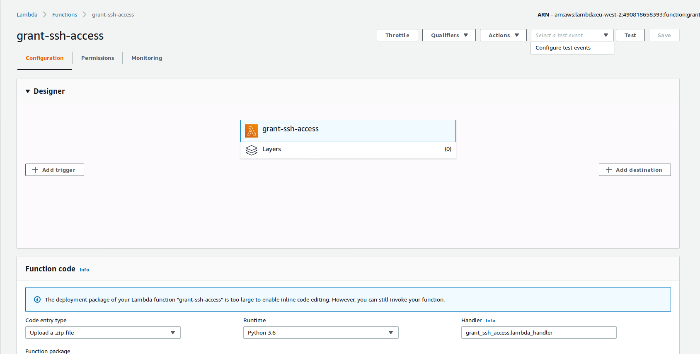

Giving Engineer Access to Vault
============

The engineer will have sent you a JSON snippet, something like the following:
```
{
    "user_name": "john.smith",
    "ttl": 14400
}
```

They will also let you know which environment you'd like to access.

The process is as follows:
1. Assume the Platform Owner role for the environment the engineer would like access to. 
    - Use the set of links at the bottom of this document or go through the [account-links page](https://github.com/hmrc/aws-users/blob/master/docs/common/account-links.md)
2. Navigate to the grant-ssh-access lambda in the AWS console. [Link](https://eu-west-2.console.aws.amazon.com/lambda/home?region=eu-west-2#/functions/grant-ssh-access?tab=configuration)
3. You will see a screen as follows: 
4. Click the 'Select a test event' dropdown menu at the top right of the page and click Configure test events: 
5. You will see a popup appear. Delete the JSON shown, and replace it with the JSON the engineer sent you: 
6. Type a name in the Event name field and click the create button at the bottom: 
7. Ensure the event that you just created is selected, and click the 'Test' button: 

  
## Webops Accounts/roles

| Environment | Account Number | Platform Owner Role |
|-------------|----------------|---------------------|
| Integration | 150648916438   | [RolePlatformOwner](https://signin.aws.amazon.com/switchrole?account=150648916438&roleName=RolePlatformOwner&displayName=RolePlatformOwner) |
| Development | 618259438944   | [RolePlatformOwner](https://signin.aws.amazon.com/switchrole?account=618259438944&roleName=RolePlatformOwner&displayName=RolePlatformOwner) |
| QA          | 248771275994   | [RolePlatformOwner](https://signin.aws.amazon.com/switchrole?account=248771275994&roleName=RolePlatformOwner&displayName=RolePlatformOwner) |
| Staging     | 186795391298   | [RolePlatformOwner](https://signin.aws.amazon.com/switchrole?account=186795391298&roleName=RolePlatformOwner&displayName=RolePlatformOwner) |
| External Test | 970278273631 | [RolePlatformOwner](https://signin.aws.amazon.com/switchrole?account=970278273631&roleName=RolePlatformOwner&displayName=RolePlatformOwner) |
| Production  | 490818658393   | [RolePlatformOwner](https://signin.aws.amazon.com/switchrole?account=490818658393&roleName=RolePlatformOwner&displayName=RolePlatformOwner) |


